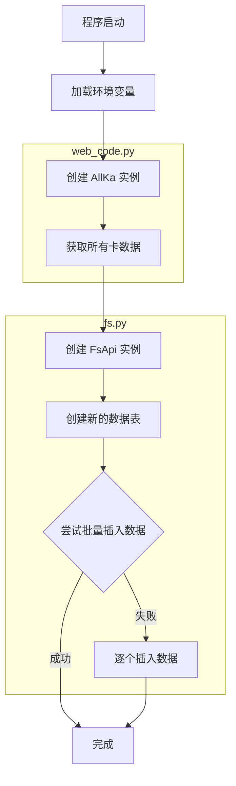

## 简介

> 2025-08-21 10:33:41

用于172 网站相关的爬虫

我的店铺链接:

[链接](https://h5.lot-ml.com/ProductEn/Index/ad6c8ab0079c1140)

获取到卡之后，就自动 上传的到飞书表格中，

[我的](https://mcne840229gb.feishu.cn/base/CrxTb4kzgazMEasEoM0cAcGvnff?table=tbluyRlwgdGVrYI1&view=vewwQrTbYI)

获取数据的时候需要补充 web_code.py 方法里面 get_all_webdata 的参数 (Authorization, cid) (去手机端抓包)

## 运行

> 2025-08-25 14:13:46

此项目 目前使用uv进行管理，

可以用下面的命令同步环境和运行代码

```bash
uv sync
uv run main.py

```

## 项目架构

该项目是一个数据采集和存储系统，主要用于从特定API获取"卡"的数据，并将其存储到飞书多维表格中。

### 架构流程图



### 模块说明

项目由三个主要模块组成：

1. **主程序模块 (main.py)**
   - 作为程序入口点
   - 协调 web_code.py 和 fs.py 模块的交互
   - 初始化 AllKa 和 FsApi 实例
   - 获取卡数据并将其存储到飞书表格中

2. **网络请求模块 (web_code.py)**
   - WebClient 类：处理 HTTP 请求的通用客户端
   - AllKa 类：专门用于获取和处理卡数据
   - 从 API 获取数据，并将其转换为结构化的字典列表

3. **飞书 API 模块 (fs.py)**
   - FsApi 类：与飞书多维表格 API 交互
   - 创建数据表
   - 插入单条或批量数据

### 数据流

1. 程序启动，加载环境变量
2. 创建 AllKa 实例，调用 get_all_ka() 方法获取所有卡数据
3. 创建 FsApi 实例，调用 add_data_table() 方法创建新的数据表
4. 尝试将所有卡数据一次性插入表中，如果失败则逐个插入
